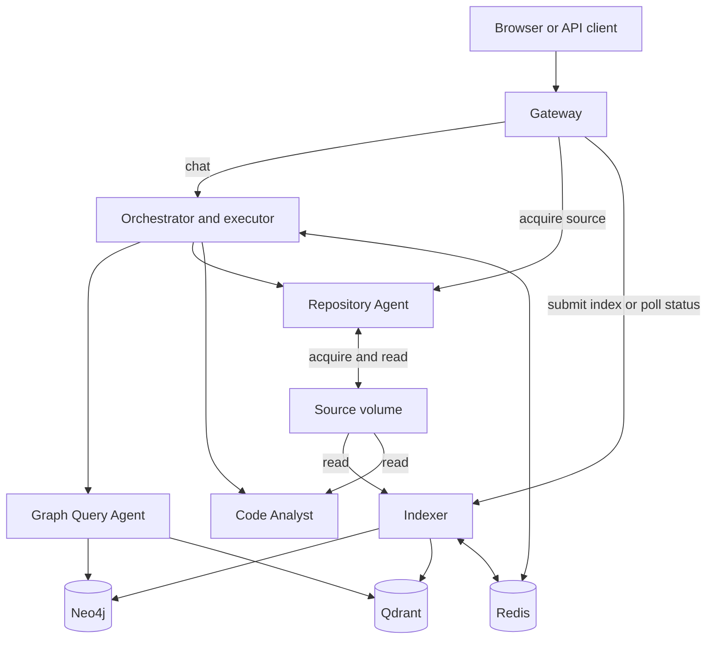

# FastAPI Repository Chat Agent — Project Design

This guide explains the implemented system through one running example: **“Explain code for `APIRouter`.”** Read the example first, then the details. Proposed improvements are labeled **Future**.

## Product in one sentence

The system answers FastAPI repository questions by finding code, reading it, and returning an explanation with source references.

For example, an implementation question should lead to an actual definition in the indexed source. An optional LLM can improve wording, but the system first builds an answer from retrieved facts without a model call.

## 1. Scope and assumptions

There are five MCP service roles: Orchestrator, Indexer, Graph Query, Repository, and Code Analyst. The assignment names four while asking for five; Repository Agent supplies the additional acquisition/source-access role. Gateway is the public API/UI service.

Source must be acquired or mounted and indexed before ordinary questions can use it. Indexing is an explicit operational request, not something chat starts whenever evidence is missing. The code is parsed and read; it is never imported or executed to answer questions.

The intended source is a controlled Git snapshot. Current graph scope filters and source-checkout fallbacks have limits, so a revision field alone does not guarantee complete isolation. Those limits are explained below.

## 2. Architecture



For an implementation question, the Orchestrator invokes Graph → Repository → Analyst in sequence. Those agents return to the Orchestrator; they do not start one another. The Gateway also makes direct operational/health calls, which are separate from chat.

### Runtime services

| Service | Example responsibility | Persistent state |
| --- | --- | --- |
| Gateway | Accept a question and return its answer | Conversation state stays in Redis, outside this process |
| Orchestrator | Choose lookup → verify → analyze and combine results | Sessions/cache/audits/episodes in Redis |
| Indexer | Turn `create_item()` calling `validate_item()` into graph data | Graph, vectors, manifests, job records |
| Graph Query | Locate `APIRouter` or retrieve a relationship | Reads Neo4j and optional Qdrant |
| Repository | Acquire a Git commit; verify a selected file | Git cache and source snapshots |
| Code Analyst | Extract a class's bases and methods from source | Reads source; no conversation store |
| Neo4j | Store entities and `CALLS`/inheritance links | Graph records and revision memberships |
| Qdrant | Find candidate code from a behavioral question | Vectors and bounded source payloads |
| Redis | Remember the entity for a follow-up; track an index job | Operational/session records with store-specific retention |

The complete Compose stack has nine services: six application services and three datastores. The browser UI is served by Gateway, not a separate container.

### Technology-to-component mapping

| Need | Implementation |
| --- | --- |
| HTTP API and browser assets | FastAPI, Uvicorn, vanilla HTML/CSS/JavaScript |
| Cross-process tool calls | MCP server/client over Streamable HTTP |
| Input/result shapes | Pydantic models |
| Planning and scheduling | Custom Python service, executor, and `asyncio` |
| Static source facts | Python `ast` |
| Structural persistence | Neo4j async driver and Cypher |
| Semantic retrieval | FastEmbed local vectors and Qdrant |
| Shared operational state | Redis async client |
| Optional answer rewrite | Compatible Responses API synthesizer |
| Request logs | `structlog`, correlation `ContextVar`, boundary timers |
| Runtime configuration | Pydantic Settings and Docker Compose |

## 3. Repository layout

Look in `apps/<service>/server.py` for an entry point, then in `src/repo_chat` for its implementation. For example, Orchestrator's entry point starts its MCP server; its planning logic lives in `src/repo_chat/orchestration/service.py`.

```text
apps/                         # Service entry points
src/repo_chat/
  gateway/                    # Public routes, service adapter, browser assets
  orchestration/              # Planning, executor, memory, synthesis
  indexing/                   # AST parsing, jobs, manifests, locks
  graph/                      # Persistence, resolution, query service, safety
  repository/                 # Git acquisition and source-access service
  analysis/                   # SourceStore and Code Analyst
  semantic/                   # FastEmbed/Qdrant adapter
  mcp/                        # Outbound MCP client and retry handling
  contracts/                  # Pydantic data models
  config/                     # Settings
  observability/              # Correlation and logging
  evaluation/                 # Golden-response checks
tests/                        # Unit/integration coverage and fixtures
scripts/                      # Live golden and load-smoke runners
docker/                       # Service Dockerfiles
compose.yaml                  # Service connections and volumes
```

## 4. Request flow

### Chat

For “Explain code for `APIRouter`” on a cache miss:

1. Gateway validates the message, assigns session/trace IDs, and checks HTTP capacity.
2. Orchestrator loads context and preferences, identifies implementation intent and `APIRouter`, stores the user turn, and builds a plan.
3. The executor sends `find_entity` to Graph and selects a credible definition.
4. It sends the candidate file path and session repository/revision to Repository `verify_source`.
5. It sends the path and entity name to Analyst `explain_implementation`.
6. Orchestrator renders the returned facts and evidence into a deterministic answer, then optionally requests an LLM rewrite.
7. It stores the assistant turn and eligible cache/audit/episode records. Gateway returns JSON or frames the completed response into stream events.

A cache hit after planning skips specialist execution and synthesis. A reference-dependent follow-up bypasses the shared response cache.

### Observability and request tracing

If the answer returns trace ID `demo-42`, search service logs for that ID. HTTP middleware binds it to the current request, MCP clients forward it, and server middleware adds it to logs. Timings help locate a slow boundary. The ID connects log entries; it is not a full parent/child span tree.

SSE sends working-status events while waiting and answer chunks after synthesis. The current UI uses completed JSON, even though SSE/WebSocket APIs are available. WebSocket does not share all HTTP middleware/admission behavior.

### Snapshot provenance

Suppose Repository Agent acquired commit A. It writes a marker with the commit, remote, requested ref, and timestamps. After successful indexing, Indexer copies available Git details into Neo4j and records its job ID and indexing time.

This tells a reader where evidence came from. It does not compare every source read to an expected hash. The Indexer's recorded `captured_at` is the job creation time; the acquisition marker has its own capture timestamp. Missing/invalid marker data leaves Git fields unavailable.

### Concurrency and 1,000-user scalability

Graph must supply a path before source analysis can run, so those stages are sequential. Once multiple locations are known, up to six independent definition analyses can run concurrently inside one executor task.

If a Gateway has 32 active HTTP chat slots, request 33 is rejected with `429` until a slot is available. This is a per-process limit. “1,000 users” must specify an arrival rate and concurrency; a small cached local test does not prove that capacity. **Future:** shared quotas, connection reuse, durable indexing workers, and measured scaling of each bottleneck.

### Indexing

Suppose revision B has an unchanged file, an edited file, and a deleted file:

1. Acquire or mount B's source, submit `POST /api/index`, and receive a job ID.
2. Indexer registers the job in Redis and starts a Python background task.
3. It acquires a repository lock and parses all discovered Python files, including unchanged ones.
4. It resolves cross-file names, reuses unchanged graph/vector data when eligible, and writes changed data.
5. It updates Redis manifests/counts after file operations. On successful processing, it reconciles removed paths and records completion provenance/status.

“Reconcile” means making target-revision index records match the discovered paths, such as removing B's membership for a deleted file while retaining A's historical membership. Neo4j, Qdrant, and Redis updates are separate; a failure can leave earlier writes committed. Atomic activation of all indexes is **Future**.

See [Indexer](05_INDEXER.md) for source-volume examples and exact write order.

## 5. Routing design

For “Explain code for `APIRouter`,” the analysis includes:

```json
{
  "query": "Explain code for `APIRouter`",
  "intent": "implementation",
  "entities": [{"name": "APIRouter", "source": "backtick"}],
  "needs_graph": true,
  "needs_source": true,
  "needs_index": false,
  "ambiguity": 0.0
}
```

The phrase “explain code” matches a keyword rule. Backticks provide the symbol. The ambiguity number is a fixed heuristic, not a model probability. No LLM performs intent/entity classification or replanning.

| Question shape | Current plan |
| --- | --- |
| Entity lookup with an entity | Graph lookup |
| Dependency intent with an entity | Graph lookup → outgoing dependencies |
| Implementation/comparison/pattern | Graph lookup → Repository verification → appropriate Analyst operation |
| Known lifecycle/concept | Predefined symbol map, then the applicable retrieval/source route |
| General discovery without strong symbol hints | Graph hybrid search → Repository verification → Analyst |
| Indexing command | An Indexer task is planned but rejected by the chat executor; use `/api/index` |

For “what calls this?”, outgoing dependencies are the wrong direction; the current route does not yet choose all incoming Graph tools. Also, plain name lookup lacks complete repository/revision filtering. A nearest vector candidate or a matching name is not automatically the correct answer.

The executor supplies concrete arguments and normalizes outputs. The scheduler groups by `sequence`; `depends_on` documents dependencies but is not independently scheduled. Each task has a deadline, with a separate Gateway request timeout.

## 6. MCP contracts

Imagine calling Graph with `find_entity(name="APIRouter")`. The tool returns its entity-search contract. Analyst returns a different analysis contract. MCP carries structured content, and the executor adapts these results into a common internal shape:

```text
AgentOutput
  agent, operation, success
  data
  evidence
  warnings
  error
```

Evidence may contain a graph entity/path or a source location with repository, revision, file, lines, hash, and excerpt. Pydantic validates shapes; it does not prove the semantic truth of the data. Tool contracts are defined in [contracts](../src/repo_chat/contracts/orchestration.py), not a universal invented `ToolResult` envelope.

### Failure policy

- **An eligible read times out:** the MCP client may retry with increasing randomized delays, within configured limits.
- **The first Graph stage fails:** source stages stop because their required locations are missing. No automatic source-only replan occurs.
- **Analyst fails after Graph succeeded:** earlier facts can remain in a partial answer with a warning.
- **Optional LLM fails:** keep the deterministic draft and append a fallback warning.
- **Core conversation memory fails:** the whole chat can fail; optional cache/audit/episode errors are caught separately.

There is no implemented circuit breaker. A stored warning alone does not always imply `partial=true`; successful aggregate multi-entity analysis may include subcall warnings.

## 7. Knowledge graph

### Identity strategy

Two repositories may both define `Router`. The primary entity ID includes repository ID, file path, kind, and qualified name. Revision memberships are separate links. The primary ID builder does not include a revision or source span.

Content hashes track source content. Because entity IDs can be reused, historical membership is not a guarantee that every old entity property remains an immutable historical copy.

### Nodes

Files, modules, classes, functions, methods, parameters, decorators, imports, and docstrings are entity kinds. Repository/revision nodes group them; external symbols record unresolved references. See the [actual schema](../src/repo_chat/graph/schema.py) and [writer](../src/repo_chat/graph/repository.py) for stored properties.

### Relationships

For illustrative code, `create_item` calling `validate_item` can become:

```text
create_item ──CALLS──> validate_item
```

Other supported relationships include containment, imports, inheritance, decorators, parameters, documentation, dependencies, and revision membership. A cross-file resolution pass connects references after definitions are known. Dynamic/ambiguous targets retain uncertainty.

### Safe custom Cypher

A custom query containing a write keyword or procedure call is rejected. Accepted reads receive a result cap. However, returning ten rows can still require expensive search. Read-only database credentials and database execution limits are separate deployment controls; `_records()` does not set an explicit transaction timeout.

## 8. Conversation memory

Ask “Find `APIRouter`,” then “Show the implementation of it” with the same session ID. Redis stores recent turns and active entity names, allowing supported follow-up rules to reuse `APIRouter`.

The session stores a bounded window with a sliding expiration time, not a model-generated rolling summary. `WATCH` retries conflicting turn appends. Preferences, response caches, routing audits, and user episodes have separate records. Episodes require `user_id`, filter by repository, and rank word/entity overlap; they do not filter by revision.

### Source store versus memory store

Redis remembers what the conversation referred to. The source volume contains the code. Neo4j supplies locations and relationships; the executor passes locations to Analyst, which reads independently through `SourceStore`.

For an illustrative `return await fetch_item(item_id)`, AST analysis can report an awaited call and return expression. It does not establish the database used by `fetch_item` or execute the function.

Repository Agent creates acquired snapshots. SourceStore prefers them but can fall back to a local checkout. It computes a hash; chat verification does not supply the expected hash needed for comparison. Acquisition publication is atomic for one directory, while indexing has no all-store transaction or automatic snapshot-retention manager.

## 9. Public API

### `POST /api/chat`

Supply `message` and optional session/user/repository/revision fields; `stream` selects SSE. Preferences are managed through separate session-preference endpoints. The JSON response contains answer, session/trace IDs, evidence, agents used, warnings, and partial status.

For example, a caller can keep `session_id="demo"` for “Find `APIRouter`” and the next question. SSE and WebSocket send status while work runs and chunks after the complete answer is ready. Disconnect handling cancels the local task; it does not prove remote work or an accepted index job stopped.

### `POST /api/index`

Supply repository path, ID, revision, and `full` or `incremental` mode. `202 Accepted` returns job ID/status URL: it means the job was submitted, not that all files were indexed. Poll its status until completed/failed.

Acquisition is a separate `POST /api/repositories/acquire`. After restart, persisted jobs can be inspected, but interrupted in-process work is marked failed rather than resumed.

### Other endpoints

- `GET /api/index/status/{job_id}`
- `GET /api/agents/health`
- `GET /api/graph/statistics`
- `GET` / `PUT /api/sessions/{session_id}/preferences`
- `WS /ws/chat`
- `GET /health/live` and `GET /health/ready`

Liveness checks the Gateway process. Readiness checks Orchestrator reachability. Neither proves that FastAPI has already been successfully indexed.

## 10. Configuration and security

Each process constructs shared `Settings` with its service name. Environment values choose addresses, credentials, timeouts, retries, source limits, model settings, and admission limits.

For example, Repository acquisition rejects unapproved remote hosts, while SourceStore rejects paths escaping its configured root. These checks address different operations. Read-only mounts restrict writes by the receiving container; they do not stop another writer on the same host volume.

Implemented controls include Git URL/ref checks, no shell interpolation for Git, snapshot symlink/size checks, bounded Analyst reads, Cypher policy, and HTTP admission. **Future deployment work:** authentication/authorization, TLS, global per-user quotas, separate database roles, secret management, and scanning. These are not automatically supplied by MCP or Compose.

## 11. Observability

For a failed HTTP request, use its trace ID to join Gateway, MCP client, and MCP server logs. Look for the failing tool, duration, and retry outcome. The code avoids recording complete prompt/source payloads as routine log fields.

Full OpenTelemetry spans, datastore instrumentation, metrics export, dashboards, and alerts are **Future**. WebSocket correlation differs from the HTTP middleware path, as detailed in [Observability](13_OBSERVABILITY.md).

## 12. Testing strategy

For “Explain `APIRouter`,” assert acceptable source paths and agent participation instead of one exact sentence. A correct answer may use different wording; a fluent answer with the wrong source still needs investigation.

| Layer | Example check |
| --- | --- |
| Unit | Backticks identify `APIRouter`; AST detects an async function |
| Contract | MCP arguments/results have expected fields |
| Integration | Parsed fixture entities can be written/read in Neo4j |
| Golden | Known live questions return required agents, evidence, concepts, and trace IDs |
| Resilience | Analyst failure preserves earlier graph evidence |
| Load smoke | A configured workload distinguishes `200`, `429`, and failures |

Historical records include an earlier nine-answer golden run and a later 10/10 run including streaming. Those results concern their recorded revision/configuration; this documentation rewrite does not rerun the deployment or establish a new accuracy/capacity result.

## 13. Delivery phases

A useful development sequence is: start services → index a small fixture → answer an implementation question → exercise follow-ups and failures → test real repository questions → measure a specified workload. This provides observable results at each step.

For example, first prove that `create_item CALLS validate_item` survives parsing and persistence before attempting a broad lifecycle explanation. See [Walkthrough](WALKTHROUGH.md) for runnable demonstrations.

## 14. Decisions and trade-offs

- **Custom routing:** Easy to trace “explain code” to an implementation plan, but unfamiliar wording needs rules or discovery improvements.
- **Graph plus vectors:** Exact relationships and behavioral search support different questions, at the cost of another datastore.
- **AST analysis:** Extracts facts without executing code, but cannot prove runtime dispatch.
- **In-process jobs:** Simple to submit, but a process crash ends execution even if Redis retains the job record.
- **Optional LLM:** Can improve prose, but invalid output or provider failure must leave a usable draft.

## 15. Definition of done

A usable local flow starts services, acquires/indexes a chosen revision, answers supported questions with inspectable evidence, remembers supported follow-ups, and reports failures clearly. Relevant checks should pass for the behavior being changed.

Production readiness additionally needs durable work/recovery, stronger revision isolation, access control, deployment limits, and measured reliability. The [component ownership map](01_ARCHITECTURE_OVERVIEW.md) links each detailed guide and its source references.

## 16. Clarifying design questions

### How does the Graph Query Agent know what search query to construct?

The Graph Query Agent does not read the raw user message and invent a Cypher query with an LLM. It receives a structured MCP tool call from the Orchestrator/executor.

For example, this user message:

```text
Explain code for APIRouter
```

is first analyzed by the Orchestrator. It produces an implementation intent and the entity `APIRouter`. The route then calls Graph with a concrete operation such as:

```text
find_entity(name="APIRouter", limit=10)
```

For broader questions, the executor may call:

```text
hybrid_search(query="How is request validation handled?", repository_id="fastapi", revision="<sha>", limit=10)
```

Inside Graph Query Agent, the tool name decides the database query template. `find_entity` uses a bounded name/qualified-name lookup. `hybrid_search` combines exact graph lookup with Qdrant semantic results. `get_dependencies` and `get_dependents` use traversal templates over allowed relationship types. The LLM is not generating Cypher.

Interview answer: “The Orchestrator chooses the tool and arguments. The Graph Agent owns fixed, parameterized query templates and safe bounded reads. User text may be passed as a search string to hybrid retrieval, but it is not turned into arbitrary Cypher by a model.”

### What are requested symbols and source symbols?

A **requested symbol** is the name the user or concept map asked for. Example:

```text
User asks: Explain APIRouter
Requested symbol: APIRouter
```

A **source symbol** is the actual code entity found in the repository. Example:

```text
Source symbol: fastapi.routing.APIRouter
File: fastapi/routing.py
Kind: class
```

This distinction matters because user names are often short or approximate. `Router`, `APIRouter`, and `fastapi.routing.APIRouter` are not equally precise. The executor tries to select a credible source symbol for the requested symbol before source verification and analysis.

### What is a broad query versus a normal query?

A normal symbol query names the thing directly:

```text
Explain APIRouter
What is solve_dependencies?
```

The Orchestrator can extract the symbol and start with graph lookup.

A broad query asks about a concept or behavior without naming one exact function:

```text
How does request validation work?
How does FastAPI dependency injection work?
What is the request lifecycle?
```

For known concepts, the Orchestrator uses a small deterministic concept map. For example, dependency injection maps to symbols such as `Depends`, `get_dependant`, and `solve_dependencies`. For unknown broad wording, it uses hybrid search so semantic retrieval can propose candidates.

The “broad” status is not a separate public API enum. It is an explanation of how the current routing behaves when no single explicit symbol is enough.

### How is conversation context maintained?

Conversation context is maintained with a session ID. The Gateway accepts a `session_id` from the caller or creates one. The Orchestrator stores recent turns, active entities, repository ID, and revision in Redis.

Example:

```text
Turn 1: Find APIRouter
Redis active_entities: ["APIRouter"]

Turn 2: Show the implementation of it
Orchestrator sees "it" and reuses APIRouter
```

There is no full account-management system in the local stack. A `user_id` can be supplied for optional cross-session episodic memory, but authentication, authorization, tenant ownership, and user lifecycle management are future deployment work.

### What are typed async services and non-blocking I/O?

“Typed services” means each boundary has explicit request and response models. For example, chat returns `ChatResponse`, indexing returns `IndexJob`, and source verification returns `SourceVerification`. The code uses Pydantic and Python type hints so each layer knows the expected shape.

“Async services” means service methods can `await` slow I/O instead of blocking the event loop. For example, the Gateway awaits an MCP call, the Graph Agent awaits Neo4j, and the Indexer awaits Redis/Neo4j/Qdrant operations.

“Non-blocking I/O” means waiting for network, database, or socket work does not freeze the whole process. It does not mean CPU-heavy Python parsing becomes automatically parallel.

### What is FastEmbed/ONNX with `BAAI/bge-small-en-v1.5`?

FastEmbed is the local embedding library used by the project. It loads an embedding model and converts text into numeric vectors. The configured model is `BAAI/bge-small-en-v1.5`, a small English embedding model. FastEmbed runs the model locally, commonly through ONNX Runtime, so the project does not need to call an external embedding API for every chunk.

Example:

```text
Text: "function solve_dependencies reads dependency declarations..."
Vector: [0.01, -0.03, ...]
```

Qdrant stores that vector plus payload such as repository ID, revision, file path, lines, and entity name. Later, a question like “where are dependencies solved?” is embedded too, and Qdrant retrieves nearby code chunks.

### How does `analyze_query` produce structured intent/entities/ambiguity without an LLM?

It uses deterministic rules:

- keyword checks classify intent, such as `explain code` -> implementation;
- backticks extract exact symbols, such as `` `APIRouter` ``;
- capitalization rules capture symbol-like names;
- concept maps expand known topics such as lifecycle and dependency injection;
- reference words such as `it` can reuse active entities from Redis;
- fixed flags decide whether graph/source/index evidence is needed;
- ambiguity is a simple heuristic, not a model probability.

This is predictable and easy to test. The trade-off is that unusual wording may be missed. A future LLM classifier could improve recall, but it must still produce typed, validated output and should not bypass evidence checks.

### Does Redis periodically refresh a conversation summary?

No. The current implementation does not create a model-generated rolling summary. Redis stores a bounded recent-turn window and refreshes the session TTL when the context is read or updated.

“Refresh” means the expiration time is extended, not that a summary is rewritten.

### What does bounded conversational state mean?

Bounded means the stored context has limits:

- only the latest configured number of turns is kept;
- only the latest active entity names are retained;
- the session key expires after inactivity;
- episodes and audits also have maximum record counts and TTLs.

This prevents Redis from growing forever because of one long conversation. The trade-off is that very old context may disappear unless captured in optional episodic memory.

### What does the in-process Indexer job paragraph mean?

When `/api/index` accepts a repository job, it writes a job record to Redis and starts a Python task inside the Indexer process.

Redis stores:

```text
job id
status
processed file count
failed file count
error message
timestamps
```

The Python process performs the actual work. If that process restarts, Redis may still contain the job record, but the running Python task is gone. The next Indexer process marks unfinished jobs as failed/interrupted so users are not left thinking the job is still running.

That is why restart preserves status and counters, but does not resume execution from the middle. A durable queue/worker would be the future design for safe resume.

### Should intent/entity classification move to an LLM?

It can, but it should be introduced as a controlled classifier, not as free-form planning. The current deterministic classifier is precise, testable, cheap, and does not need a provider. Its weakness is recall: out-of-pattern queries can be classified too broadly or miss entities.

A good future design is hybrid:

1. Run deterministic rules first for high-confidence cases.
2. Use an LLM classifier only when ambiguity is high or no useful entity is found.
3. Require the LLM to return a strict schema: intent, entities, confidence, evidence needs.
4. Validate entity candidates through Graph/Repository/Analyst before citation.
5. Log classifier confidence and fallback decisions for evaluation.

### Should indexing be atomic across Neo4j, Qdrant, and Redis?

Ideally, users should only see a revision after all stores are ready. But Neo4j, Qdrant, and Redis do not share one database transaction. The current implementation coordinates writes in an application-defined order and records completion status, but it cannot roll back all stores as one unit if a late step fails.

A future improvement is an atomic activation pointer:

1. Write new graph/vector/manifest data under a staging revision or job ID.
2. Validate counts and sample lookups.
3. Flip one small “active revision” record when all stores are ready.
4. Let chat only read active revisions.
5. Clean up failed staging data asynchronously.

That gives atomic visibility even though the underlying stores still do separate writes.
