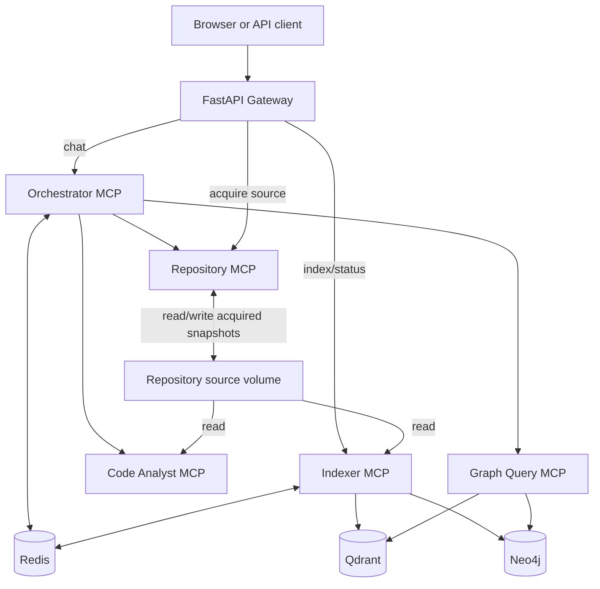

# FastAPI Repository Chat Agent

This repository contains a multi-agent code-understanding system for the FastAPI source repository. It indexes Python code into a knowledge graph and vector store, then answers natural-language questions with grounded source references.

The system is designed as a small production-style service stack rather than a notebook demo. It includes a public FastAPI Gateway, five MCP services, Redis operational state, Neo4j graph storage, Qdrant semantic retrieval, tests, Dockerfiles, and a written walkthrough.

## Submission Documents

- [DESIGN.md](DESIGN.md) explains the architecture, agent boundaries, indexing flow, retrieval strategy, failure behavior, and current limitations.
- [WALKTHROUGH.md](WALKTHROUGH.md) is the required written walkthrough and can also be used as a 10-15 minute demo script.

## What The System Does

The application supports questions such as:

- `Show the implementation of APIRouter`
- `What depends on it?`
- `Explain the complete lifecycle of a FastAPI request`
- `Compare how Path and Query parameters are implemented`
- `How does dependency injection work in FastAPI?`

For an implementation question, the runtime flow is:

```text
Client
  -> FastAPI Gateway
  -> Orchestrator MCP
  -> Graph Query MCP
  -> Repository MCP
  -> Code Analyst MCP
  -> grounded response with source evidence
```

The Indexer runs before chat. It parses repository source with Python `ast`, writes entities and relationships to Neo4j, stores semantic code vectors in Qdrant through FastEmbed, and persists job state/manifests in Redis.

## Architecture



### Services

| Service | Responsibility |
| --- | --- |
| Gateway | Public REST/SSE/WebSocket API, browser UI, request admission, trace IDs |
| Orchestrator | Intent/entity analysis, deterministic routing, agent coordination, synthesis, memory |
| Indexer | Repository parsing, graph/vector construction, incremental manifests, job lifecycle |
| Graph Query Agent | Neo4j lookup/traversal and hybrid graph/vector retrieval |
| Repository Agent | Safe Git acquisition, metadata, bounded source reads, source verification |
| Code Analyst | AST-based source explanation, snippets, pattern detection, implementation comparison |
| Redis | Sessions, preferences, cache, audits, index jobs, manifests, idempotency, locks |
| Neo4j | Revision-aware code entities and relationships |
| Qdrant | Semantic vectors for class/function/method chunks |

## Repository Layout

```text
apps/                 Service entry points
src/repo_chat/        Application packages and MCP implementations
tests/                Unit and opt-in integration tests
docker/               Service Dockerfiles
scripts/              Golden evaluation and load-smoke scripts
evaluations/          Golden query definitions
repositories/         Local source checkout mount point
compose.yaml          Docker Compose stack
DESIGN.md             Architecture and design handover
WALKTHROUGH.md        Submission walkthrough/demo script
```

Local checkout folders such as `repositories/fastapi`, `repositories/cross-file-demo`, and `repositories/reconcile-demo` are ignored by Git. Only `repositories/.gitkeep` is committed.

## Prerequisites

- Docker with Compose support
- Python 3.12-compatible environment if running tests locally
- `uv` for local Python commands
- Neo4j password configured in `.env`

Create local configuration:

```bash
cp .env.example .env
```

Set at least:

```dotenv
REPO_CHAT_NEO4J_PASSWORD=replace-with-a-local-password
```

Optional LLM synthesis is disabled unless `REPO_CHAT_LLM_ENABLED=true` and an API key is provided.

## Start The Stack

From the repository root:

```bash
docker compose up -d --build
docker compose ps
curl http://localhost:8000/health/ready
```

If your environment uses the older Compose binary, the equivalent command is:

```bash
docker-compose up -d --build
```

The Gateway is available at:

```text
http://localhost:8000
```

## Acquire And Index A Repository

Repository source can be mounted under `repositories/`, or acquired through the Repository Agent.

Acquire an approved Git repository:

```bash
curl -sS -X POST http://localhost:8000/api/repositories/acquire \
  -H 'content-type: application/json' \
  -d '{
    "repository_id": "fastapi-upstream",
    "remote_url": "https://github.com/fastapi/fastapi.git",
    "ref": "master"
  }' | jq
```

Index a mounted or acquired revision:

```bash
curl -sS -X POST http://localhost:8000/api/index \
  -H 'content-type: application/json' \
  -d '{
    "repository_path": "fastapi",
    "repository_id": "fastapi",
    "revision": "YOUR_REVISION",
    "mode": "full"
  }' | jq
```

Poll job status:

```bash
curl -sS http://localhost:8000/api/index/status/YOUR_JOB_ID | jq
```

Indexing writes structural entities and relationships to Neo4j, semantic chunks to Qdrant when enabled, and progress/manifests/locks to Redis. The API returns a job ID immediately; completion must be checked through the status endpoint.

## Ask Questions

```bash
curl -sS -X POST http://localhost:8000/api/chat \
  -H 'content-type: application/json' \
  -d '{
    "message": "Show the implementation of APIRouter",
    "session_id": "demo-session",
    "repository_id": "fastapi",
    "revision": "YOUR_REVISION"
  }' | jq
```

Follow-up questions can reuse session context:

```bash
curl -sS -X POST http://localhost:8000/api/chat \
  -H 'content-type: application/json' \
  -d '{
    "message": "What depends on it?",
    "session_id": "demo-session"
  }' | jq
```

Set `"stream": true` to receive Server-Sent Events. WebSocket chat is available at `/ws/chat`.

## Testing

Run the unit test suite:

```bash
uv run pytest tests/unit
```

Run all default tests:

```bash
uv run pytest
```

Opt-in integration tests require live Redis/Neo4j configuration:

```bash
RUN_E2E_INTEGRATION=1 uv run pytest tests/integration/test_live_gateway_flow.py -vv -s
RUN_NEO4J_INTEGRATION=1 uv run pytest tests/integration/test_neo4j_persistence.py -vv -s
```

Golden evaluation against a running stack:

```bash
uv run python scripts/run_golden_evaluation.py --revision YOUR_REVISION
```

Load smoke test:

```bash
uv run python scripts/run_load_smoke.py --revision YOUR_REVISION --concurrency 3 --requests 10
```

## Observability

Every public HTTP request receives or accepts an `X-Correlation-ID`. The Gateway returns this trace ID and forwards it through MCP calls. Gateway, MCP client, and MCP server boundaries emit structured logs with duration, outcome, retry status, and error codes.

Inspect logs for one request:

```bash
docker compose logs gateway orchestrator indexer graph-agent repository-agent code-analyst \
  | rg 'PASTE_TRACE_ID_HERE'
```

The implementation provides correlation logging, not a full OpenTelemetry span backend. Full metrics, dashboards, and distributed traces are listed as future production work in [DESIGN.md](DESIGN.md).

## Current Limitations

- LLM synthesis is optional and runs after deterministic evidence retrieval; it is not the planner.
- Intent/entity classification is deterministic and rule-based; unusual wording may need hybrid retrieval or future LLM classification.
- MCP connections are short-lived per tool call.
- Some graph lookups have incomplete repository/revision filtering compared with hybrid search.
- Source verification computes hashes, but the current executor does not pass expected indexed hashes for comparison.
- Indexing spans Neo4j, Qdrant, and Redis without one shared atomic transaction.
- Index jobs are tracked durably in Redis, but execution itself is an in-process task and does not resume automatically after process death.
- WebSocket chat does not currently share the same admission semaphore as HTTP chat.

## Submission Checklist Coverage

- Source code, tests, Dockerfiles, Compose configuration, scripts, and documentation are included.
- `docker compose up -d --build` starts the service stack.
- [DESIGN.md](DESIGN.md) covers system architecture, agent design decisions, communication, synthesis, reliability, security, and limitations.
- [WALKTHROUGH.md](WALKTHROUGH.md) covers setup, indexing, graph population, example queries, multi-agent collaboration, and observability.
